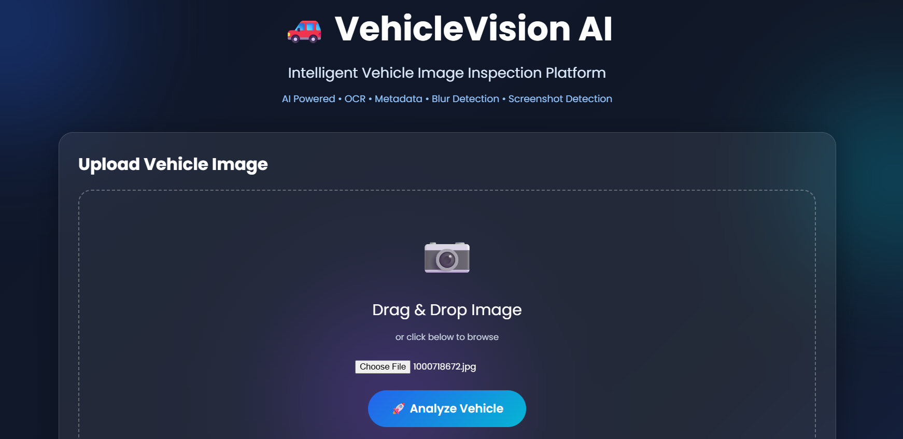
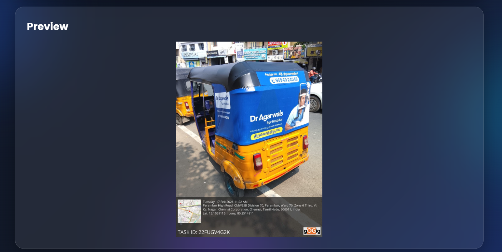
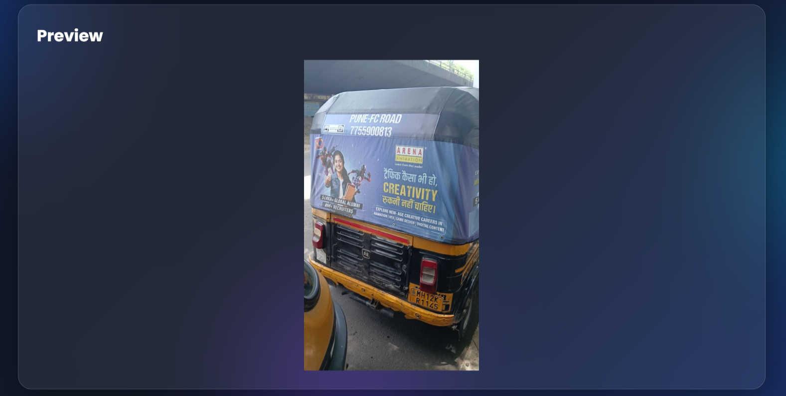
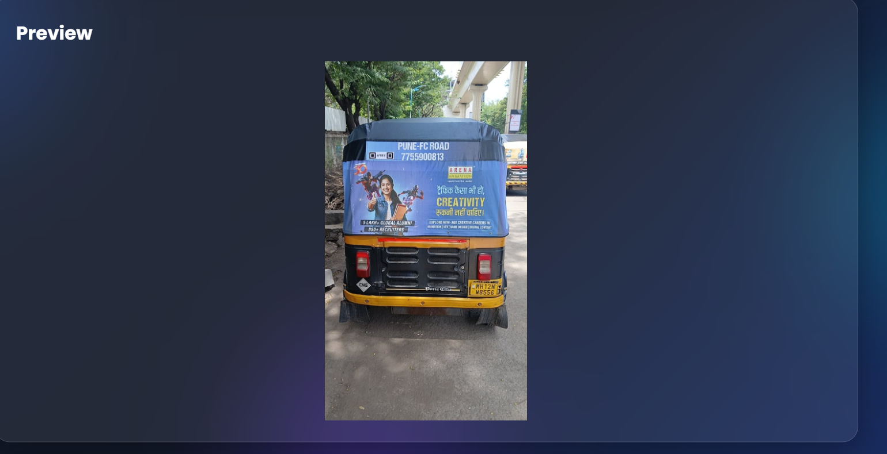

# 🚗 VehicleVision-AI Backend

An intelligent asynchronous media processing backend built using **Node.js**, **Express.js**, **MySQL**, **Redis (BullMQ)**, **Sharp**, **Tesseract OCR**, and **YOLO AI**.

The system allows users to upload vehicle images, processes them asynchronously, performs multiple image quality checks, detects objects, extracts vehicle registration numbers using OCR, and stores the results in MySQL.

---

# Features

- Image Upload API
- Asynchronous Processing using BullMQ & Redis
- MySQL Database Integration
- OCR-based Vehicle Number Extraction
- Indian Vehicle Number Validation
- YOLO AI Object Detection
- Blur Detection
- Brightness Analysis
- Image Dimension Analysis
- Duplicate Image Detection using SHA-256
- Processing Status API
- Processing Result API

---

# Tech Stack

## Backend
- Node.js
- Express.js

## Database
- MySQL

## Queue
- Redis
- BullMQ

## AI / Image Processing
- Sharp
- Tesseract.js
- YOLOv8
- Crypto (SHA-256)

---

# Project Structure

```
VehicleVision-AI
│
├── src
│   ├── config
│   ├── controllers
│   ├── middleware
│   ├── queue
│   ├── routes
│   ├── services
│   ├── uploads
│   ├── utils
│   └── workers
│
├── package.json
├── server.js
├── README.md
└── .env
```

---

# Architecture

The project follows a modular backend architecture.

```
Client
   │
   ▼
Upload API (Express)
   │
   ▼
Store Image Metadata (MySQL)
   │
   ▼
Add Job to Redis Queue (BullMQ)
   │
   ▼
Background Worker
   │
   ├── Image Analysis
   ├── Duplicate Detection
   ├── YOLO Object Detection
   ├── OCR
   └── Vehicle Number Validation
   │
   ▼
Update MySQL
   │
   ▼
Status API / Result API
```

---

# Service Flow

1. User uploads a vehicle image.
2. Server stores the uploaded image.
3. Image metadata is saved in MySQL.
4. A unique Processing ID is generated.
5. Processing job is added to Redis using BullMQ.
6. Upload API immediately returns a response.
7. Background worker processes the image asynchronously.
8. Image quality analysis is performed.
9. Duplicate image detection is executed.
10. YOLO detects objects in the image.
11. OCR extracts the vehicle number.
12. Vehicle number is validated.
13. Results are stored in MySQL.
14. Client fetches processing status and final result.

---

# Processing Flow

```
Image Upload
      │
      ▼
Save Metadata
      │
      ▼
Redis Queue
      │
      ▼
Worker
      │
      ├── Blur Detection
      ├── Brightness Analysis
      ├── Duplicate Detection
      ├── YOLO Detection
      ├── OCR
      └── Validation
      │
      ▼
Update Database
      │
      ▼
Result API
```

---

# Queue Strategy

The upload API returns immediately after storing image metadata and adding the job to BullMQ.

Heavy image processing tasks are executed by background workers.

Advantages:

- Non-blocking API
- Better scalability
- Improved response time
- Multiple workers can process jobs concurrently

---

# Major Design Decisions

- Used BullMQ for asynchronous processing.
- Redis acts as the message broker.
- MySQL stores image metadata and analysis results.
- OCR is implemented using Tesseract.js.
- YOLO is used for AI object detection.
- SHA-256 hashing is used for duplicate image detection.
- REST APIs are designed separately for upload, status, and results.

---

# Installation

Clone the repository

```bash
git clone <repository-url>
```

Go to project

```bash
cd VehicleVision-AI
```

Install dependencies

```bash
npm install
```

Start Redis

```bash
docker run -d --name redis-server -p 6379:6379 redis
```

Start Backend

```bash
npm start
```

Start Worker

```bash
node src/workers/imageWorker.js
```

---

# Environment Variables

Create a `.env` file.

```env
PORT=5000

DB_HOST=localhost
DB_USER=root
DB_PASSWORD=your_password
DB_NAME=vehiclevision

REDIS_HOST=localhost
REDIS_PORT=6379
```

---

# API Endpoints

## Upload Image

### Request

```
POST /api/upload
```

### Response

```json
{
  "success": true,
  "processingId": "UUID",
  "status": "pending"
}
```

---

## Processing Status

### Request

```
GET /api/status/:processingId
```

### Response

```json
{
  "success": true,
  "status": "completed"
}
```

---

## Processing Result

### Request

```
GET /api/result/:processingId
```

### Response

```json
{
  "success": true,
  "processingId": "UUID",
  "status": "completed",
  "vehicleNumber": "MH12NW8556",
  "analysis": {
    "width": 640,
    "height": 480,
    "brightnessScore": 122.5,
    "blurScore": 96
  }
}
```

---

# AI Usage Disclosure

AI tools were used during development for:

- BullMQ implementation guidance
- OCR integration
- Image analysis logic
- API design suggestions
- Documentation generation
- Debugging assistance

### Where AI Output Was Incorrect

Some AI-generated OCR validation logic did not correctly handle Indian vehicle registration formats. Minor implementation suggestions also required modification to fit the project architecture.

### Validation Process

All AI-generated code was manually reviewed, integrated, tested, and verified using Postman and the provided sample vehicle images before being accepted.

---

# Trade-offs

Due to limited development time:

- Used SHA-256 hashing for duplicate detection instead of perceptual hashing.
- Used regex validation for Indian vehicle numbers.
- Used a lightweight YOLO model for faster inference.
- Images are stored locally instead of cloud storage.
- Single worker instance is used.

---

# Scalability Considerations

With additional development time:

- Deploy multiple BullMQ workers.
- Store images in cloud storage (AWS S3, Azure Blob).
- Use managed Redis.
- Use managed MySQL.
- Add caching for API responses.
- Implement horizontal scaling.

---

# Failure Handling

The application handles failures by:

- Returning proper HTTP status codes.
- Updating processing status as **failed**.
- Logging worker errors.
- Returning **NOT_DETECTED** when OCR fails.
- Rejecting invalid vehicle numbers using regex.
- Detecting duplicate images before processing.

---

# Assumptions

- Images are uploaded individually.
- Supported image formats are JPG and PNG.
- Redis and MySQL are available before running the application.
- Vehicle registration numbers follow Indian registration standards.
- Users poll the Status API before requesting the Result API.

---

# Future Improvements

- Screenshot Detection
- Photo-of-Photo Detection
- Image Tampering Detection
- Confidence Scoring
- Retry Mechanism
- Automated Unit Tests
- Docker Compose
- Cloud Deployment
- Dashboard UI
- Authentication
- Rate Limiting
- Monitoring & Logging

---

# Sample Workflow

1. Upload vehicle image.
2. Receive Processing ID.
3. Poll Status API.
4. Fetch processing result.
5. Display vehicle number and image analysis.

---

## Output

### Dashboard



---

### Input Image 1



### Analysis Result 1


---

### Input Image 2



### Analysis Result 2


---

### Input Image 3



### Analysis Result 3


---


# Author

**Rakshitha**

Backend Assignment – VehicleVision-AI